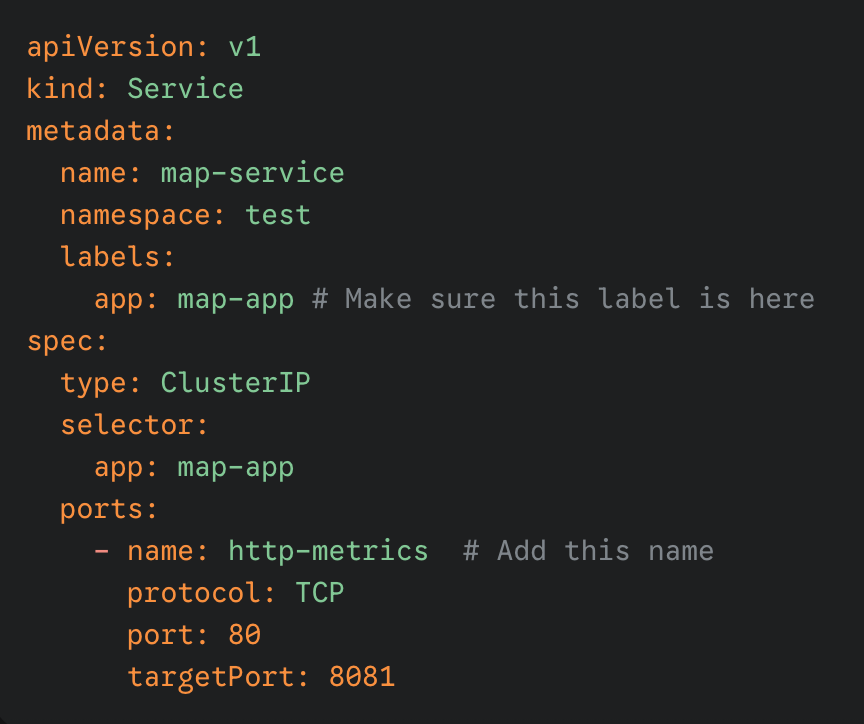
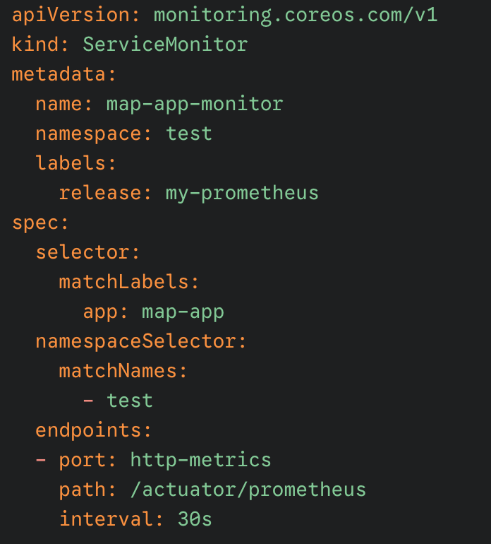

minikube delete --all --purge

minikube start --cpus=4 --memory=7168

# Add the repository
helm repo add prometheus-community https://prometheus-community.github.io/helm-charts
helm repo update

# Install the stack into a 'monitoring' namespace
helm install my-prometheus prometheus-community/kube-prometheus-stack \
--create-namespace \
--namespace monitoring

# Install the istioctl service mesh
brew install istioctl
istioctl version

# Install Istio into your cluster
#  Use the demo profile to install the control plane and the necessary CRDs:
istioctl install --set profile=demo -y

# Label the default namespace to enable automatic sidecar injection
kubectl label namespace default istio-injection=enabled

minikube image load map:2.0
minikube image load map:3.0

# Create a test namespace and deploy the sample application
kubectl apply -f namespace.yaml -n test
kubectl apply -f destination-rule.yaml -n test
kubectl apply -f virtual-service.yaml -n test
kubectl apply -f map-monitor.yaml -n test
kubectl apply -f deployment-v1.yaml -n test
kubectl apply -f deployment-v2.yaml -n test

# NodePort to localhost
minikube service map-service -n test

// to hit the api to create logs
kubectl get pods -n test 
kubectl port-forward map-deployment-f4c69769f-cw4j8 8081 -n test

kubectl port-forward svc/my-prometheus-grafana 3000:80 -n monitoring

kubectl port-forward svc/my-prometheus-kube-prometheus-prometheus 9090:9090 -n monitoring

do not run [for open node port service]
-- kubectl patch svc my-prometheus-grafana -n monitoring -p '{"spec": {"type": "NodePort"}}'

for getting grafana admin password
kubectl get secret -n monitoring my-prometheus-grafana -o jsonpath="{.data.admin-user}" | base64 --decode ; echo
kubectl get secret -n monitoring my-prometheus-grafana -o jsonpath="{.data.admin-password}" | base64 --decode ; echo

# Opens the Kiali dashboard in your default browser
kubectl apply -f https://raw.githubusercontent.com/istio/istio/release-1.24/samples/addons/kiali.yaml
istioctl dashboard kiali -n istio-system
kubectl get pods -n istio-system

kubectl edit configmap kiali -n istio-system
spec:
external_services:
prometheus:
url: "http://my-prometheus-kube-prometh-prometheus.monitoring.svc.cluster.local:9090"

kubectl rollout restart deployment kiali -n istio-system
istioctl dashboard kiali -n istio-system